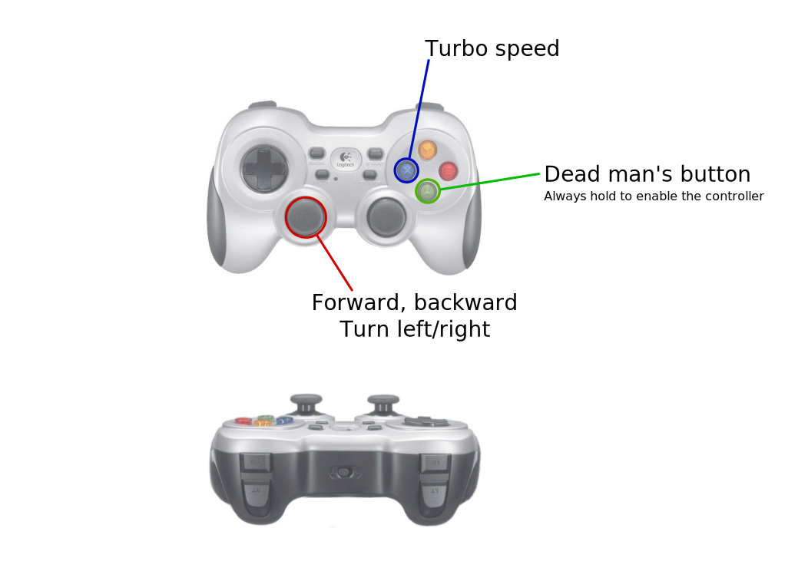

<!--
SPDX-License-Identifier: BSD-3-Clause
SPDX-FileCopyrightText: Czech Technical University in Prague
-->

# Standard Linux gamepad mappings

This directory contains mappings for translating gamepads to the following structure that corresponds to the reference gamepad Logitech F710.

The reference gamepad looks like this:



The remappings should make sure the same physically placed button does the same action as on the reference gamepad.

```yaml
buttons:
  0: A, green (bottom color button)
  1: B, red (left color button)
  2: X, blue (right color button)
  3: Y, yellow (top color button)
  4: LB (top left button/trigger on back side)
  5: RB (top right button/trigger on back side)
  6: Apps/Back/Select button (left small in the middle)
  7: Options/Start button (right small in the middle)
  8: Vendor button (power-on, not all gamepads have it)
  9: Left joy press
  10: Right joy press
axes:
  0: Left joy left-right (left = 1, right = -1)
  1: Left joy top-down (top = 1, down = -1)
  2: Axis for LT (bottom left trigger on back side) (fully released = 1, fully pressed = -1)
  3: Right joy left-right (left = 1, right = -1)
  4: Right joy top-down (top = 1, down = -1)
  5: Axis for RT (bottom right trigger on back side) (fully released = 1, fully pressed = -1)
  6: D-Pad/hat/arrows left-right (left = 1, right = -1)
  7: D-Pad/hat/arrows top-down (top = 1, down = -1)
# Make sure to run the joy_node with ~default_trig_val:=true, otherwise LT and RT will report 0 until pressed.
```
